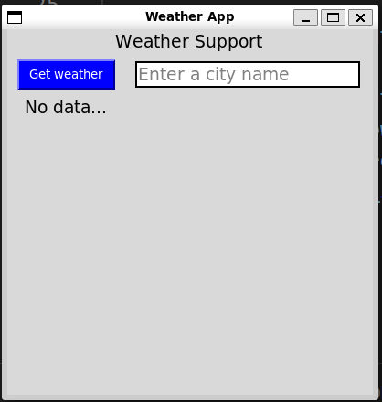
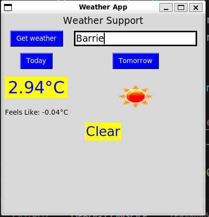

# Weather App

## Introduction

Weather app displays weather information for the city entered by user on the app.

## App guide

To start the app use *"src/main/py"* file, run following command on the terminal to start the app,

```

python src/main.py


```

**Note:** If *"python"* , does not work try using *"python3"* *

Once the app starts, it would display a window as shown below,



User could add the city name and click *Get Weather*, it would display
- Two new button
    - Today (Giving today's weather)
    - Tomorrow (Giving weather for next day)
- Temperature 
- Feels like temperature
- weather condition
- weather image




## Setup Guide

Python version: 3.12.2
Set up python 3.12.2 on your local machine

*Recommendation: Use **pyenv** to manage the version and setup a virtual enviorment*

Once python is set and have created a virtual enviorment use command given below to install all required packages

``` 

 pip install -r requirements.txt

```

 **Note:** If you face any issues installing packages using following commands to install them individually

```

 pip install requests
 pip install Pillow

```

 Once the set up is done, Create a *".env"* file and add, 
 - API_KEY
 - BASE_URL

 * Note: Use the exact same text for the above 2 variable *

 Populate *"API_KEY"* with the token for weather api, one can get by registering at "https://openweathermap.org/api".
 For *"BASE_UR"* one could use "http://api.openweathermap.org/data/2.5/weather"


 **!!! Congratulation you have set the applcation**